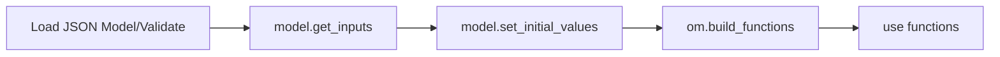

# OpenMDAO Development Map 2026

Author: Rob Falck
Date: 2026-01-12

## Retrospective 2025

Some restructuring in our team last year resulted in the departure of a few of our team members. They were great people and will be missed.

We achieved some of our main targets for the year, including relevance for partial derivatives and the passing of units information based on connection. While good progress was made towards post-optimality sensitivity, the lack of second derivatives in the current implementation of [MAUD](https://websites.umich.edu/~mdolaboratory/pdf/Hwang2018a.pdf) is a hindrance that needs to be addressed.

## 2026 Focus

This year, we're aiming for some aggressive advances to OpenMDAO to decrease the workload for users, improve modularity, and make OpenMDAO easier to integrate into a larger ecosystem that may involve other analysis frameworks or AI-driven workflows.

These changes are intended to make working with OpenMDAO simpler, but we also recognize that we cannot expect users to go through a painful transition process. We still need to support the existing mode of operation while transitioning users to a better way of doing things

### Decoupling Models from Execution

In OpenMDAO, models are an ephemeral thing that is assembled during the setup stack, executed using the same classes used to assemble the model itself, and then discarded. The user cannot know the exact structure of their model except by interrogating it at various points in the setup or execution process.

We want to make those models their own thing which is persistent, serializable, and composable.

Groups will no longer be a class to be overridden by the user, but a more basic container for subsystems, connections, and solver algorithms. We will provide pydantic.BaseModel-derived specifications for Groups and Components such that models can be serialized and deserialized. Once assembled, the notion of setting up a model again is unnecessary.

With inputs, outputs, and options defined as pydantic fields, the need to call `setup()` on a model is no longer there. If we utilize AD-related tools like Jax or Julia for our compute methods, then components can be defined as a set of inputs, outputs, and the function which provides the compute logic.
User-defined derivatives would require letting the component specification know the function that computes the partials or the jacobian-vector products. Critically, we will still need to support existing components as well.

#### Easier Introspection

This should make complex-OpenMDAO use-cases that involve introspection considerably easier.
A huge amount of dymos' codebase is dedicated to introspection. With these changes, theres no more messing around with setup, configure, and figuring out what exists at any given time.  Instead, the next generation of dymos would accept the users ODE system not as a class to be instantiated, but as fully defined ODE including specifications of metadata like units and shapes.  The notion of binding state metadata to that ODE system also becomes easier. 

If a user has a complicated aerodynamics model and wants to swap it in place of another model in my system, as long as the interfaces are compatible the user can just replace their model in the model specification or JSON.

#### Enabling Graphical User Interfaces

We've often had users request something along the lines of a GUI for OpenMDAO. In the past, with models defined imperatively, we couldn't do this because you'd inevitably want to recreate the code which provides the model defined in your GUI. What if the inputs to that model were defined programmatically, how could we know. Switching to a declarative approach with pydantic negates that limitation, meaning going from graphically assembled [XDSM diagram](https://mdolab.engin.umich.edu/wiki/xdsm-overview) to a functional computational would be possible.

#### A Separate Execution Engine

In OpenMDAO <= 3, the same Systems/Groups used to define the model also provide much of the computation algorithm. If we first build this model instead, we can run it through a separate _MAUD-Engine_ (for the lack of a better term) to convert inputs into outputs and to provide relevant derivatives. While the mathematics of MAUD is fairly compute-efficient, it does involve some iteration. Keeping the definition of the model itself in Python makes sense for usability reasons, but separating the computational aspect
makes it possible to define the _MAUD-Engine_ in some other language if we choose to do so.

### Functional Access for Wider Generality

OpenMDAO should not be required to be the top-level of a user's workflow. We spent a considerable amount of time developing AnalysisDriver, but life for users would be simpler if they could just call their OpenMDAO model as a function to get the data they want from it.  When OpenMDAO was first started, there was some expectation that users who wanted to use a particular optimization algorithm would develop a `Driver` to handle that. By and large, that hasn't happened. Users of OpenMDAO use those Drivers that the development team have provided. Theres an ever-increasing number of optimization techniques out there, and many just need a simple functional interface. If we just make it possible to generate that functional interface, we expand the utility of OpenMDAO by quite a bit.

Notionally, we would want to be able to work with any optimizer that just needs functions for the primal computation and then derivatives:

```python
f, df = om.build_functions(model,
                           inputs=['x', 'y'],
                           outputs=['obj', 'con'],
                           compute_totals=True,
                           color_totals=False)

result = scipy.optimize.minimize(f, x0, jac=df)
```

Or for the example of parameter sweeps:

```python
f = om.build_functions(model,
                       inputs=['x', 'y'],
                       outputs=['obj', 'con'])

x_vals = np.linspace(0, 10, 100)
y_vals = np.linspace(0, 10, 100)

results = []
for x, y in itertools.product(x_vals, y_vals):
    obj, con = f(x, y)
    results.append((x, y, obj, con))
```

Or potentially use OpenMDAO within a `jax` workflow:

```python


f, df = om.build_functions(model,
                           inputs=['x', 'y'],
                           outputs=['obj', 'con'],
                           compute_totals=True,
                           color_totals=False)

# Wrap as JAX-compatible function with custom VJP
def openmdao_primal(x, y):
    """Forward pass using OpenMDAO"""
    obj, con = f(x, y)
    return jnp.array([obj, con])

def openmdao_vjp(x, y):
    """Custom VJP using OpenMDAO derivatives"""
    # Forward pass
    outputs = openmdao_primal(x, y)
    
    def vjp_fn(v):
        """Vector-Jacobian product: v^T * J"""
        # Get Jacobian from OpenMDAO
        J = df(x, y)  # Returns dict like {'obj': {'x': ..., 'y': ...}, 'con': {...}}
        
        # Contract with cotangent vector v
        # v is [v_obj, v_con]
        vjp_x = v[0] * J['obj']['x'] + v[1] * J['con']['x']
        vjp_y = v[0] * J['obj']['y'] + v[1] * J['con']['y']
        
        return (vjp_x, vjp_y)
    
    return outputs, vjp_fn

# Register custom VJP with JAX
openmdao_primal.defvjp(openmdao_vjp)
```

### Notional Usage Workflow

With the user's model defined via a Pydantic BaseModel-derived specification, we need to load it.
As part of the model validation, we'll perform some of the duties of OpenMDAO's current setup process:
1. Check that connections are internally consistent.

```python
import json
import numpy as np
import openmdao.api as om
from openmdao.specs import GroupSpec

# Load and validate model from JSON
# Pydantic validation checks connection consistency, variable references, etc.
with open('my_model.json') as f:
    model = GroupSpec.model_validate(json.load(f))

# Interrogate the model to see what inputs need values
required_inputs = model.get_inputs()
# Returns: {'x': VariableSpec(shape=None, units='kg'), 
#           'y': VariableSpec(shape=(3,), units='m'), ...}

# Set initial values for shape inference and defaults
# Supports: dict, DataFrame, tuple notation for units
model.set_initial_values({
    'x': (np.zeros(3), 'kg'),      # Dynamic shape - tuple with units
    'y': 5.0,                      # Uses units from model spec
    'z': (np.ones((2, 2)), 'N*m')  # 2D array with units
})

# Compile model into callable functions
# This allocates MAUD vectors and returns executable functions
f, df = om.compile(model, 
                   inputs=['x', 'y'],      # Function arguments
                   outputs=['obj', 'con'])  # Function returns

# Execute
obj, con = f(np.ones(3), 6.0)
```



### On Second Derivatives

We previously expressed a desire for second derivatives in OpenMDAO.  Many optimizers are known to perform better when they are available, but it's always felt like a burden to require that they be provided analytically by the user.  While we can finite-difference the partials of some derivatives, this wouldn't be tractable for larger problems. As we continue to push the use of tools like jax and Julia for component calculations, the ability to easily get high quality second order derivatives from components becomes easier, and the functional interface could potentially be made to also return a callable that provides a hessian-vector product. This would wait until after the MAUD Engine is functional for our current capability.

### Pseudo-Explicit Models

The MAUD architecture uses a "fully implicit form".  That is, each submodel is expected to provide its residuals and their derivatives to models above it.  In OpenMDAO <= 3, we break this assumption in ExplicitComponent.
ExplicitComponent only exposes the derivatives of its outputs wrt the intputs. Technically speaking, it still poses
these in an implicit form, but the end result is that we only care about the ultimate inputs and outputs of an ExplicitComponent, not any intermediate calculations.

On the other hand, with Groups, all of the internal residuals and derivatives are exposed to the containing system.
Sometimes, this can provide more robustness because the outer-level solvers and drivers are able to see more of the interactions within the system. On the other hand, it may pose more information than necessary to the calling systems. A [2025 study from MDOLab at the University of Michigan](https://mdolab.engin.umich.edu/bibliography/Kaneko2025b.html) demonstrated the value of this capability.

OpenMDAO currently supports this via the notion of the SubModelComp, but this implementation isn't as efficient as it could be. An alternative we would like to explore is to be able to optionally execute MAUD within a group, and only expose the resulting _semi-total_ derivatives. Such a group would appear as explicit component to the outside world.

### Backwards Compatibility

OpenMDAO has had a few painful transitions between major versions in its past, and we recognize the time and energy users have put into their work.

We have a strong preference for people's models being able to work as-is via `openmdao.api`.
Then, in `openmdao.specs` we would define `ComponentSpec`, `VariableSpec`, `GroupSpec`, etc. Building a pydantic-backed Group would be done here. In addition, we will want to support a transition process so that users existing models and groups can be transitioned via something like `myComp.model_dump_json()` or `myComp.create_spec()`.

### A notional Sellar-problem system

We're still in the planning stages, but we expect to have some set of _specs_ that let us define the aspects of our systems. Using these Spec objects would allow for better integration with autocompletion in IDEs and type checking.

The sellar system could be built via python as:

```python

    # Define the two discipline components using existing OpenMDAO components via path
    d1_spec = OMExplicitComponentSpec(
        inputs=[VariableSpec(name='z', shape=(2,)),
                VariableSpec(name='x'),
                VariableSpec(name='y2')],
        outputs=[VariableSpec(name='y1')],
        path='openmdao.test_suite.components.sellar.SellarDis1withDerivatives'
    )

    d2_spec = OMExplicitComponentSpec(
        inputs=[VariableSpec(name='z', shape=(2,)),
                VariableSpec(name='y1')],
        outputs=[VariableSpec(name='y2')],
        path='openmdao.test_suite.components.sellar.SellarDis2withDerivatives'
    )

    response_spec = ExecCompSpec(
        exprs=[
            "obj = x**2 + z[1] + y1 + exp(-y2)",
            "con1 = 3.16 - y1",
            "con2 = y2 - 24.0"
        ],
        inputs=[
            VariableSpec(
                name="x",
            ),
            VariableSpec(
                name="z",
                shape=(2,),
            ),
            VariableSpec(
                name="y1",
            ),
            VariableSpec(
                name="y2",
            ),
        ],
        outputs=[
            VariableSpec(
                name="obj",
            ),
            VariableSpec(
                name="con1",
            ),
            VariableSpec(
                name="con2",
            ),
        ]
    )

    # Create the group spec with promoted subsystems
    # This follows the structure of SellarDerivatives from sellar.py
    sellar_spec = GroupSpec(
        subsystems=[
            SubsystemSpec(
                name='d1',
                system=d1_spec,
                promotes_inputs=['x', 'z', 'y2'],
                promotes_outputs=['y1']
            ),
            SubsystemSpec(
                name='d2',
                system=d2_spec,
                promotes_inputs=['z', 'y1'],
                promotes_outputs=['y2']
            ),
            SubsystemSpec(
                name='obj_cmp',
                system=response_spec,
                promotes_inputs=['x', 'z', 'y1', 'y2'],
                promotes_outputs=['obj', 'con1', 'con2']
            )
        ],
        connections=[
            # Note: In this version with promotes, d1 and d2 are connected via promoted y1 and y2
            # No explicit connections needed
        ],
        # Solver specs - Sellar is a coupled problem that requires a nonlinear solver
        nonlinear_solver=NonlinearSolverSpec(
            solver_type='NewtonSolver',
            options={'maxiter': 10,
                     'atol': 1e-10,
                     'rtol': 1e-10,
                     'solve_subsystems': False}
        ),
        linear_solver=LinearSolverSpec(
            solver_type='DirectSolver',
            options={}
        )
    )
```

The JSON for `sellar_spec`, with `exclude_defaults=True`, would then be:

```json
{
  "type": "group",
  "subsystems": [
    {
      "name": "d1",
      "system": {
        "inputs": [
          {
            "name": "z",
            "shape": [2],
          },
          {
            "name": "x",
          },
          {
            "name": "y2",
          }
        ],
        "outputs": [
          {
            "name": "y1",
          }
        ],
        "type": "OMExplicitComponent",
        "path": "openmdao.test_suite.components.sellar.SellarDis1withDerivatives"
      },
      "promotes_inputs": [
        "x",
        "z",
        "y2"
      ],
      "promotes_outputs": [
        "y1"
      ],
    },
    {
      "name": "d2",
      "system": {
        "inputs": [
          {
            "name": "z",
            "shape": [2],
          },
          {
            "name": "y1",
          }
        ],
        "outputs": [
          {
            "name": "y2",
          }
        ],
        "type": "OMExplicitComponent",
        "path": "openmdao.test_suite.components.sellar.SellarDis2withDerivatives"
      },
      "promotes_inputs": [
        "z",
        "y1"
      ],
      "promotes_outputs": [
        "y2"
      ],
    },
    {
      "name": "obj_cmp",
      "system": {
        "inputs": [
          {
            "name": "x",
            "desc": "Design variable x",
          },
          {
            "name": "z",
            "shape": [2],
          },
          {
            "name": "y1",
          },
          {
            "name": "y2",
          }
        ],
        "outputs": [
          {
            "name": "obj",
            "desc": "Objective function value",
          },
          {
            "name": "con1",
            "desc": "Constraint: 3.16 - y1 >= 0",
          },
          {
            "name": "con2",
            "desc": "Constraint: y2 - 24.0 <= 0",
          }
        ],
        "type": "ExecComp",
        "exprs": [
          "obj = x**2 + z[1] + y1 + exp(-y2)",
          "con1 = 3.16 - y1",
          "con2 = y2 - 24.0"
        ],
      },
      "promotes_inputs": [
        "x",
        "z",
        "y1",
        "y2"
      ],
      "promotes_outputs": [
        "obj",
        "con1",
        "con2"
      ],
    }
  ],
  "connections": [],
  "nonlinear_solver": {
    "solver_type": "NewtonSolver",
    "options": {
      "maxiter": 10,
      "atol": 1e-10,
      "rtol": 1e-10,
      "solve_subsystems": false
    },
  },
  "linear_solver": {
    "solver_type": "DirectSolver",
  },
}
```

The various subsystems in this model could also be serialized separately, making them modular pieces of a composable system model.

## Development Timeline

We will address the inclusion of Pydantic first, in **Q1 - Q2**.

**Phase 1 (Q1-Q2)**: Foundation
- Pydantic specs in openmdao.specs
- Basic serialization/deserialization
- Migration tooling (model_dump_json, create_spec)

**Phase 2 (Q2-Q3)**: Functional Interface
- build_functions implementation
- Integration examples (scipy, JAX, optax)

**Phase 3 (Q3-Q4)**: Advanced Features
- Pseudo-explicit groups
- MAUD-Engine separation exploration